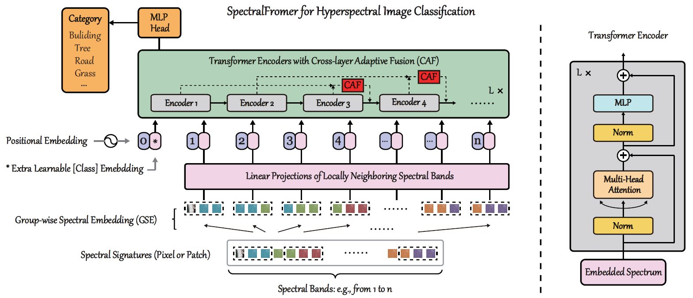

# Spectralformer: Rethinking hyperspectral image classification with transformers

[Danfeng Hong](https://sites.google.com/view/danfeng-hong), [Zhu Han](https://www.researchgate.net/profile/Zhu-Han-2), [Jing Yao](https://scholar.google.com/citations?user=1SHd5ygAAAAJ&hl=en), [Lianru Gao](https://scholar.google.com/citations?hl=en&user=f6OnhtcAAAAJ), [Bing Zhang](http://english.radi.cas.cn/Education/PhDS/201401/t20140109_115415.html), [Antonio Plaza](https://scholar.google.com/citations?user=F1UAj8oAAAAJ&hl=en), [Jocelyn Chanussot](http://jocelyn-chanussot.net/)

___________

The code in this toolbox implements the ["Spectralformer: Rethinking hyperspectral image classification with transformers"](https://ieeexplore.ieee.org/document/9627165). More specifically, it is detailed as follow.

Citation
---------------------

**Please kindly cite the papers if this code is useful and helpful for your research.**

Danfeng Hong, Zhu Han, Jing Yao, Lianru Gao, Bing Zhang, Antonio Plaza, Jocelyn Chanussot. Spectralformer: Rethinking hyperspectral image classification with transformers, IEEE Transactions on Geoscience and Remote Sensing (TGRS), 2022, vol. 60, pp. 1-15, Art no. 5518615, DOI: 10.1109/TGRS.2021.3130716.

    @article{hong2022spectralformer,
      title={Spectralformer: Rethinking hyperspectral image classification with transformers},
      author={Hong, Danfeng and Han, Zhu and Yao, Jing and Gao, Lianru and Zhang, Bing and Plaza, Antonio and Chanussot, Jocelyn},
      journal={IEEE Trans. Geosci. Remote Sens.},
      year={2022},
      volume={60},
      pages={1-15},
      note = {DOI: 10.1109/TGRS.2021.3130716}
    }
    
System-specific notes
---------------------
The data were generated by Matlab R2016a or higher versions, and the codes of networks were tested using PyTorch 1.6 version (CUDA 10.1) in Python 3.7 on Ubuntu system.

How to use it?
---------------------
This toolbox consists of two proposed modules, i.e., group-wise spectral embedding (GSE: by setting band_patches larger than 1) and cross-layer adaptive fusion (CAF: by setting mode to CAF), that can be plug-and-played into both pixel-wise and patch-wise hyperspectral image classification. For more details, please refer to the paper.

Here an example experiment is given by using **Indian Pines hyperspectral data**. Directly run **demo.py** functions with different network parameter settings to produce the results. Please note that due to the randomness of the parameter initialization, the experimental results might have slightly different from those reported in the paper.

:exclamation: Please kindly be careful on assigning arguments such as `epoches` and `weight_decay`. For re-performing of the last three columns in TABLE VIII of our paper, i.e., the **ViT**, **Pixel-wise** and **Patch-wise SpectralFormer** on the Indian Pines dataset, you can either re-train by following:

ViT: `python demo.py --dataset='Indian' --epoch=1400 --patches=1 --band_patches=1 --mode='ViT' --weight_decay=0`

Pixel-wise SpectralFormer: `python demo.py --dataset='Indian' --epoches=290 --patches=1 --band_patches=3 --mode='CAF' --weight_decay=0`

Patch-wise SpectralFormer: `python demo.py --dataset='Indian' --epoches=300 --patches=7 --band_patches=3 --mode='CAF' --weight_decay=5e-3`

or directly test by loading the network parameters in the `log` file we have tuned locally,

ViT: `python demo.py --dataset='Indian' --flag_test=test --patches=1 --band_patches=1 --mode='ViT'`

Pixel-wise SpectralFormer: `python demo.py --dataset='Indian' --flag_test=test --patches=1 --band_patches=3 --mode='CAF'`

Patch-wise SpectralFormer: `python demo.py --dataset='Indian' --flag_test=test --patches=7 --band_patches=3 --mode='CAF'`

For the datasets of **Pavia University** and **Houston**, you can download the data we use from the following links of google drive or baiduyun:

Google drive: https://drive.google.com/drive/folders/1nRphkwDZ74p-Al_O_X3feR24aRyEaJDY?usp=sharing

Baiduyun: https://pan.baidu.com/s/1ZRmPQYahqvbkMoH_B6v1xw (access code: 29qw)

Also, the suggestions for the re-training are,

Pavia University:

ViT: `python demo.py --dataset='Pavia' --epoch=1000 --patches=1 --band_patches=1 --mode='ViT' --weight_decay=0`

Pixel-wise SpectralFormer: `python demo.py --dataset='Pavia' --epoches=500 --patches=1 --band_patches=3 --mode='CAF' --weight_decay=5e-3`

Patch-wise SpectralFormer: `python demo.py --dataset='Pavia' --epoches=480 --patches=7 --band_patches=7 --mode='CAF' --weight_decay=5e-3`

Houston:

ViT: `python demo.py --dataset='Houston' --epoch=900 --patches=1 --band_patches=1 --mode='ViT' --weight_decay=0`

Pixel-wise SpectralFormer: `python demo.py --dataset='Houston' --epoches=520 --patches=1 --band_patches=3 --mode='CAF' --weight_decay=5e-3`

Patch-wise SpectralFormer: `python demo.py --dataset='Houston' --epoches=600 --patches=7 --band_patches=3 --mode='CAF' --weight_decay=5e-3`

The suggestions for the testing are,

Pavia:

ViT: `python demo.py --dataset='Pavia' --flag_test=test --patches=1 --band_patches=1 --mode='ViT'`

Pixel-wise SpectralFormer: `python demo.py --dataset='Pavia' --flag_test=test --patches=1 --band_patches=3 --mode='CAF'`

Patch-wise SpectralFormer: `python demo.py --dataset='Pavia' --flag_test=test --patches=7 --band_patches=7 --mode='CAF'`

Houston:

ViT: `python demo.py --dataset='Houston' --flag_test=test --patches=1 --band_patches=1 --mode='ViT'`

Pixel-wise SpectralFormer: `python demo.py --dataset='Houston' --flag_test=test --patches=1 --band_patches=3 --mode='CAF'`

Patch-wise SpectralFormer: `python demo.py --dataset='Houston' --flag_test=test --patches=7 --band_patches=3 --mode='CAF'`

If you encounter memory error when testing the patch-wise SpectralFormer on the Pavia and Houston datasets, commenting trainloader and some other unnecessary part of code or separting the whole image into several subimages both work.

If you want to run the code in your own data, you can accordingly change the input (e.g., data, labels) and tune the parameters.

If you encounter the bugs while using this code, please do not hesitate to contact us.

Licensing
---------

Copyright (C) 2021 Danfeng Hong

This program is free software: you can redistribute it and/or modify it under the terms of the GNU General Public License as published by the Free Software Foundation, version 3 of the License.

This program is distributed in the hope that it will be useful, but WITHOUT ANY WARRANTY; without even the implied warranty of MERCHANTABILITY or FITNESS FOR A PARTICULAR PURPOSE. See the GNU General Public License for more details.

You should have received a copy of the GNU General Public License along with this program.

Contact Information:
--------------------

Danfeng Hong: hongdf@aircas.ac.cn 
Danfeng Hong is with the Key Laboratory of Digital Earth Science, Aerospace Information Research Institute, Chinese Academy of Sciences, 100094 Beijing, China. 

Zhu Han: hanzhu19@mails.ucas.ac.cn 
Zhu Han is with the Key Laboratory of Digital Earth Science, Aerospace Information Research Institute, Chinese Academy of Sciences, Beijing 100094, China, and also with the College of Resources and Environment, University of Chinese Academy of Sciences, Beijing 100049, China.
